<div align="center">

# pase-omo

**[OmO 5](https://github.com/code-yeongyu), running natively inside [Paseo](https://getpaseo.com).**

Watch a workflow run wave by wave, answer OmO in Paseo's own question card,
and keep one clean todo card per turn — on your desktop and on your phone.

[English](README.md) · [한국어](README.ko.md)

</div>

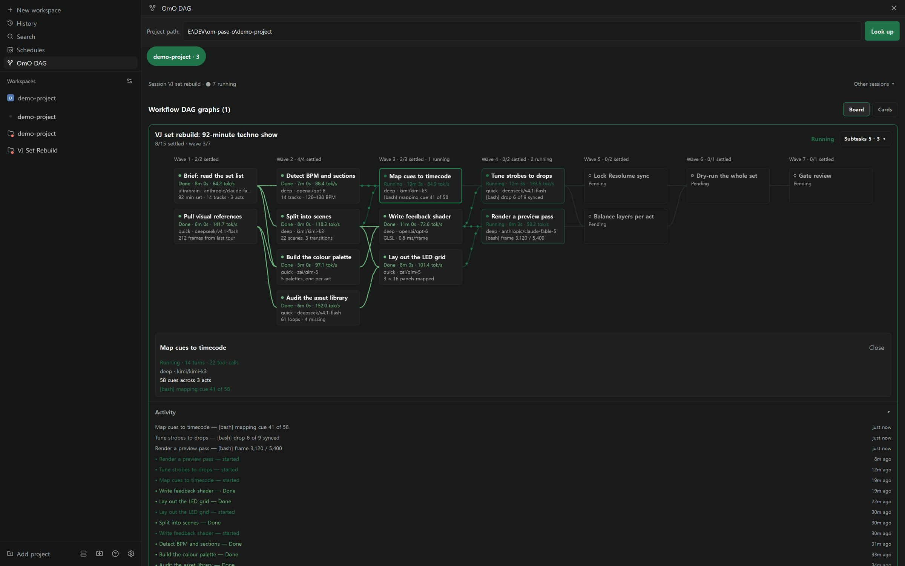

---

## What's new: OmO 5 native

OmO 5 changed how it talks to its hosts, and this plugin now speaks it directly:

- **OmO 5 is the engine.** Sessions open on OmO's own default model, the model
  picker lists every model OmO registers, and child sessions started by `task()`
  show up as real Paseo sessions.
- **Questions go through Paseo's native card.** When OmO asks something, Paseo
  draws its own question card in the chat. Pick an option, type an answer, or
  answer several questions at once — the answer goes straight back to OmO.
  The plugin's separate approval button is gone; the chat is the place to answer.
- **One todo card per turn.** OmO's todo tool no longer stacks a row in the
  chat for every tick. You get one card when the turn ends, and the composer's
  task chip shows progress while it runs.
- **A new board view for workflow runs** — below.

## The workflow board

Every `workflow` run opens as a board: one column per wave, a card per node,
and edges that carry the work from left to right.

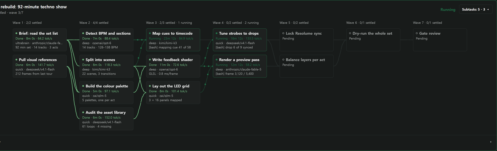

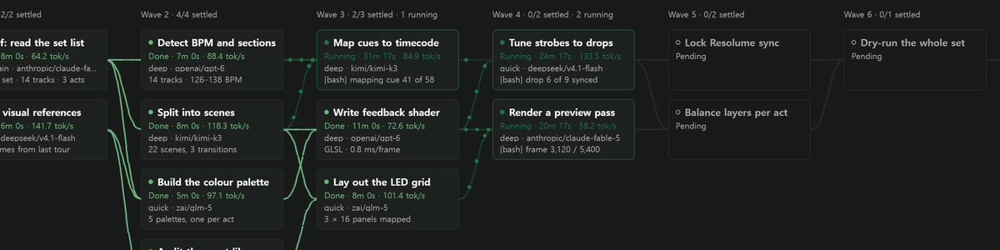

- **It follows what is running.** The board picks the session that is running
  right now and shows its one live run. The session list and the stats bar stay
  out of the way; *Other sessions* opens them when you need them.
- **Motion only where work is happening.** Edges into a running node carry
  moving dots. Finished edges turn solid green, pending ones stay grey, and the
  animation stops when nothing runs.
- **Every card says what the node is doing:** state, elapsed time and tokens per
  second, the category and model that ran it, and its live progress line.
- **Waves count themselves** — `Wave 4 · 0/2 settled · 2 running` — and the run
  header shows how far along the whole run is.

Tap a node for its details — turns, tool calls, the model, what it was asked
to do and what it is doing now:

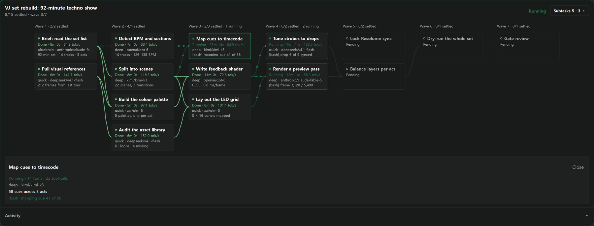

Subtasks live in a small drawer beside the board, so they never push the graph
off screen. Open it with the **Subtasks** button; running work sorts to the top:

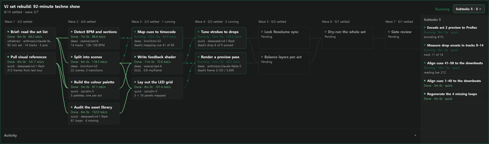

The activity log under the board lists every start, finish, error and live
progress line, newest first. Tap a line to jump to its node.

The previous card view is still one click away under **Cards**.

## In the chat

OmO's questions arrive as Paseo's native question card:

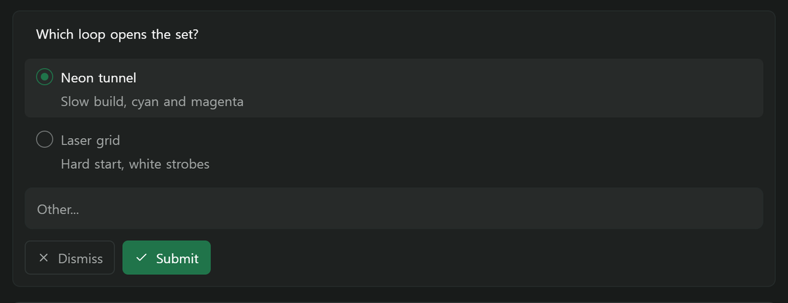

And a turn that worked through a checklist ends with a single todo card:

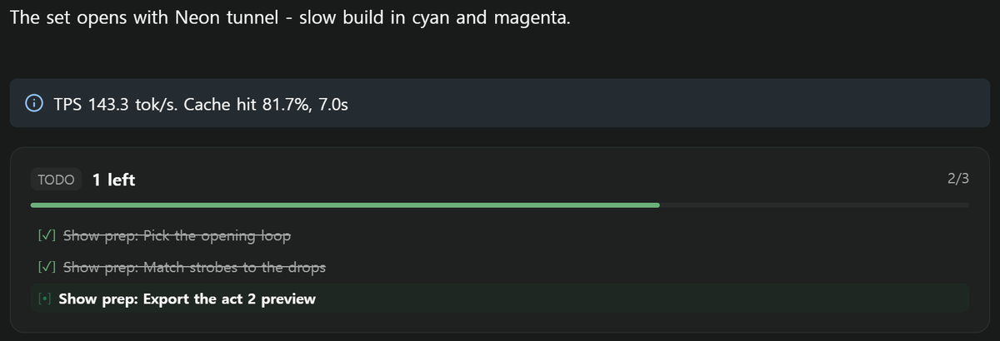

## On your phone

The board is the same board on a phone — same cards, same flow — and it scrolls
sideways instead of shrinking the type. The subtask drawer drops below the
graph, where there is room for it.

<table>
<tr>
<td width="33%">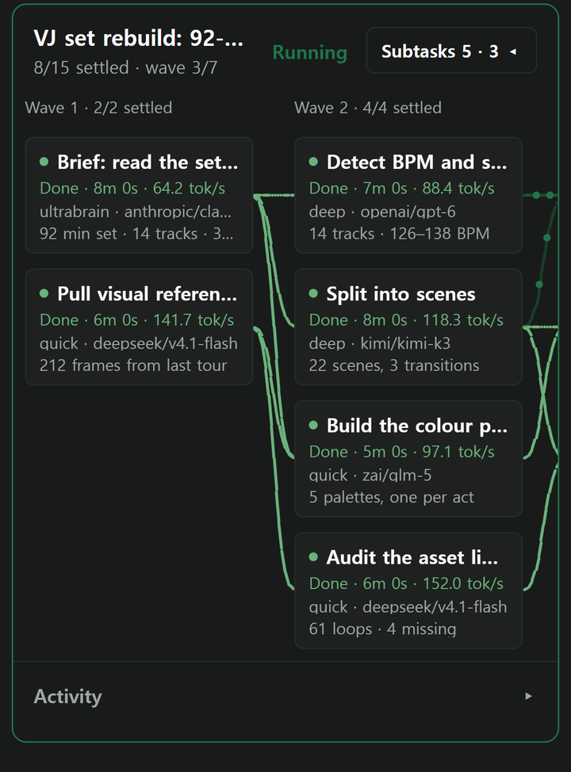</td>
<td width="33%">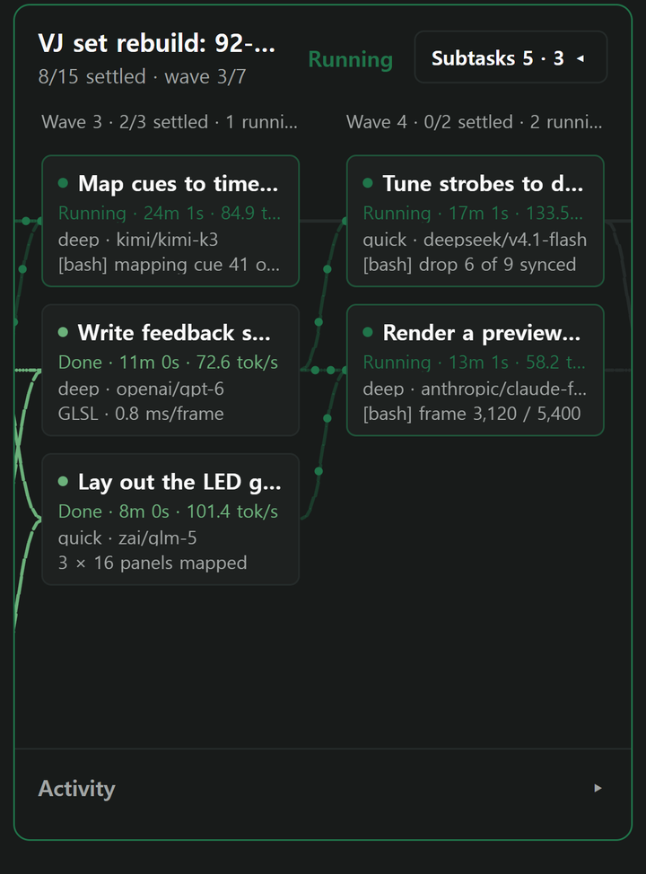</td>
<td width="33%">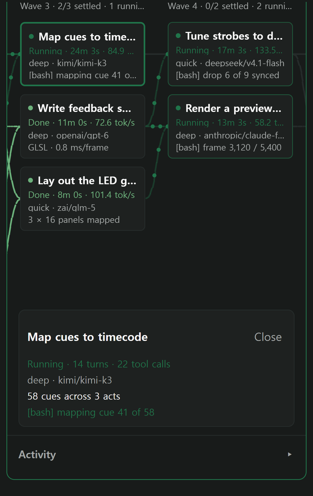</td>
</tr>
<tr>
<td align="center"><sub>Board</sub></td>
<td align="center"><sub>Running waves</sub></td>
<td align="center"><sub>Node details</sub></td>
</tr>
<tr>
<td width="33%">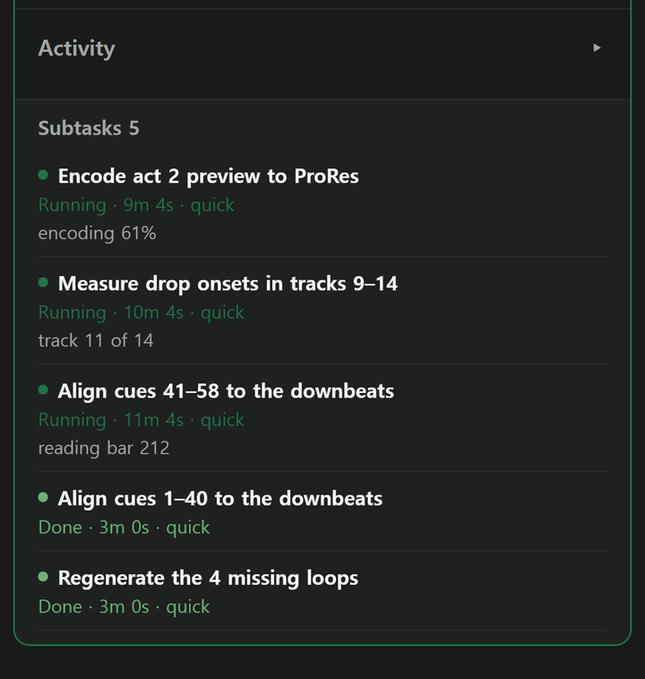</td>
<td width="33%">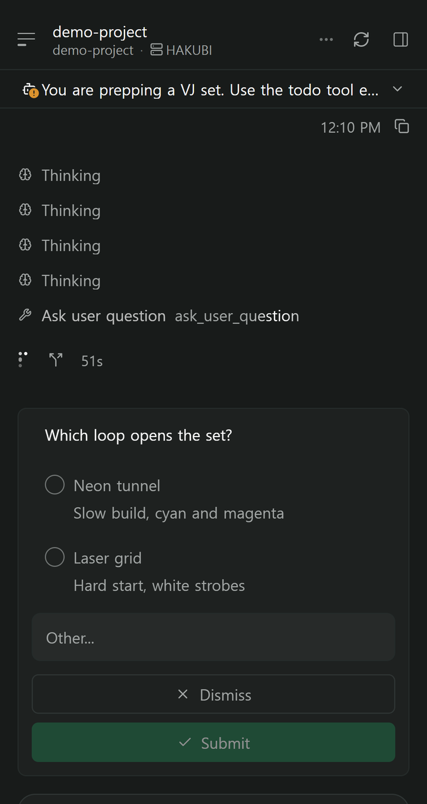</td>
<td width="33%"></td>
</tr>
<tr>
<td align="center"><sub>Subtasks</sub></td>
<td align="center"><sub>Question card</sub></td>
<td align="center"><sub>Todo card</sub></td>
</tr>
</table>

## Everything else

| Surface | What it does |
| --- | --- |
| **OmO provider** | OmO in Paseo's model picker, with streaming, tool calls and child sessions in Paseo's chat |
| **OmO DAG** | The board and card views, from the sidebar, the command center or the workspace tab bar |
| **Chat DAG card** | One card per run in the timeline, drawn once the run settles |
| **OmO Approvals** | Pending confirmations, choices and questions for the current agent |
| **OmO Folders** | Sessions, runs and tasks grouped into a browsable tree |
| **OmO update** | Pause every OmO session, update OmO, and resume them where they were |
| **Harness wrap** | OmO's harness XML, memory notes and error envelopes folded into compact bars |

---

## Requirements

- **Paseo 0.8.0 or newer** (declared in `paseo-plugin.json`)
- **OmO 5** installed and reachable. The plugin looks for OmO's Bun global
  install first (`~/.bun/install/global/node_modules/omo-ai/bin/omo.js`), then
  `omo` on `PATH`.

## Install

On the machine that runs the Paseo daemon:

```bash
paseo plugin add Hakubisual/pase-omo
```

A full Git URL works too:

```bash
paseo plugin add https://github.com/Hakubisual/pase-omo.git
```

Pin a branch, tag or commit with `--ref`:

```bash
paseo plugin add Hakubisual/pase-omo --ref main
```

### Korean interface

The `ko` branch is the same plugin with every string in Korean:

```bash
paseo plugin add Hakubisual/pase-omo --ref ko
```

### Manage it

```bash
paseo plugin ls              # installed plugins and their runtime ids
paseo plugin status          # compare installed and available refs
paseo plugin update omo      # update this plugin
paseo plugin logs omo        # recent plugin log
```

The plugin registers under the runtime id **`omo`**. Pass `--id` at install
time if that id is taken on your daemon.

After updating, restart Paseo fully (quit it from the tray) so both the app and
the daemon pick up the new code.

> **Trust every plugin you add.** Paseo plugins are not sandboxed: server code
> runs with the daemon user's access, and client code runs inside the Paseo app.

---

## Development

```bash
bun install
bun x tsc --noEmit    # types
bun x vitest run      # tests
```

No `build` step is declared, so Paseo compiles the sources on install.

| Path | Role |
| --- | --- |
| `index.client.tsx` | Every client contribution: panels, surface, commands, renderers, pills |
| `index.server.ts` | Daemon side: the agent provider, DAG and approval RPCs, the timeline publisher |
| `client/` | React Native views — the board, graph layout, DAG panel, approvals, folders, todo card |
| `server/` | Provider, session store, DAG snapshot readers, worker manager |
| `shared/` | Row schemas and RPC contracts shared by both halves |

---

## Thanks

Huge shout-out to **[YeonGyu — github.com/code-yeongyu](https://github.com/code-yeongyu)**,
the author of OmO.

OmO has genuinely been changing my life — how I work, the pace I work at, and what
I believe one person can actually ship in a day. I built this plugin because I
wanted to *see* what OmO was doing, and none of it would exist without his work.
Go look at what he builds.

Thanks to everyone who sent pull requests for OmO 5 support, and to the [Paseo](https://getpaseo.com) team for a plugin API open enough
that an agent can bring its whole interface with it.

This repository was written with [OmO](https://github.com/code-yeongyu/oh-my-openagent),
which is why OmO appears in the commit history as a co-author of its own plugin.

---

## License

MIT
